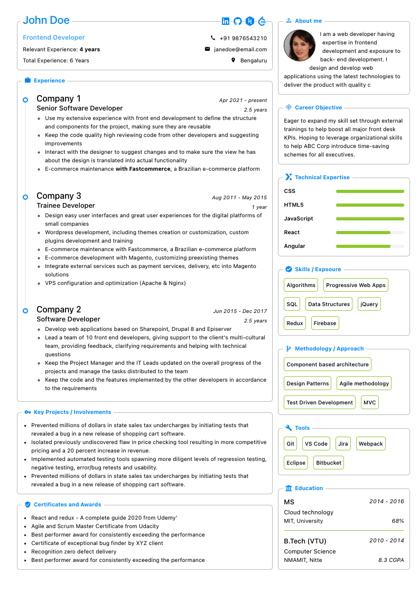
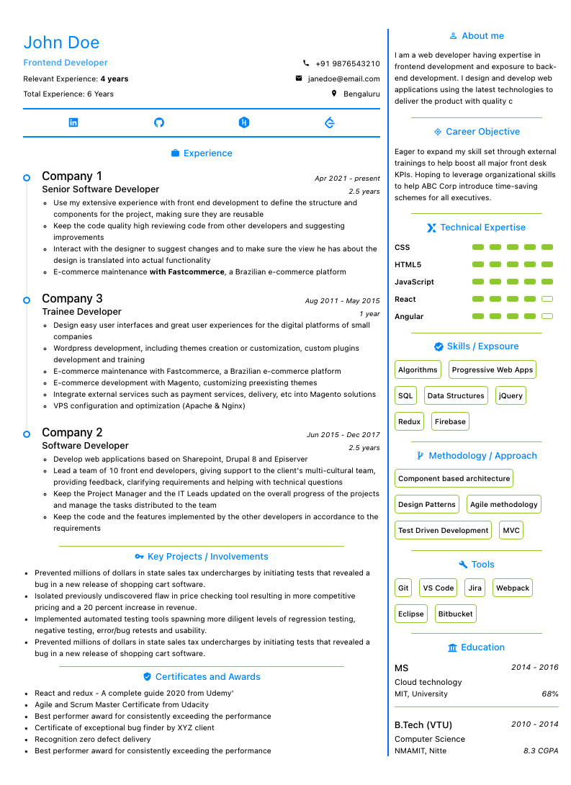

<h1>Single Page Resume Builder</h1>

### Free and open source, fully customizable professional single page resume builder

&nbsp;&nbsp;&nbsp;&nbsp;&nbsp;&nbsp;&nbsp;&nbsp;&nbsp;&nbsp;

👉 &nbsp;&nbsp;[Single Page Resume Builder](https://e-resume.vercel.app/)&nbsp;&nbsp;👈

### For users

- Replace all the placeholder with you information
- Select the template
- Click on Print and save as PDF. (In case the template is not fitting properly, follow the below recommended settings)
  - Orientation: Portrait
  - Paper size: A4
  - Scale: Fit to width
  - Margins: None
  - Print headers & footers: Uncheck (remove tick mark)
  - Background/graphics: Check (add tick mark)

### For developers

- `git clone https://github.com/sadanandpai/single-page-resume-builder.git`
- `yarn install`
- `yarn dev`

### Technologies

- [React](https://reactjs.org/) with hooks
- [Styled components](https://styled-components.com/) + [Antd](https://ant.design/docs/react/introduce) (css and component libraries)
- [Zustand](https://github.com/pmndrs/zustand) (hooks based state management library)
- [Next.js](https://nextjs.org/) (Bundler)

More features coming soon

---

Feel free to use the source to create your resume. 
Basic knowledge of HTML5, CSS and React is sufficient if you to customize the resume for your requirements.

