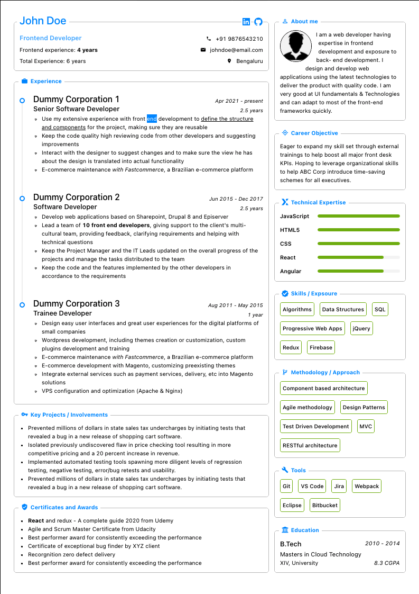

<h1>Single Page Resume Builder</h1>

### Free and open source, fully customizable professional single page resume builder

&nbsp;&nbsp;&nbsp;&nbsp;&nbsp;&nbsp;&nbsp;&nbsp;&nbsp;&nbsp;

<a href="https://sadanandpai.github.io/single-page-resume-builder/dist/">Live demo</a>

### Running in your local

- `git clone https://github.com/sadanandpai/single-page-resume-builder.git`
- `npm install` (after navigating inside the directory)
- `npm start`

### Usage (We recommend latest version of Chrome browser)

- Edit data.ts file with your details (/src/components/common)
- Modify the template you want to use inside resume-templates folder to fit your data well (As of now 2 templates are present)
- Additional customizations to each section can be done at each component level
- Once ready, click on `Print` and save as PDF
- In case the template is not fitting properly, follow the below recommended settings
  - Orientation: Portrait
  - Paper size: A4
  - Scale: Fit to width
  - Margins: None
  - Print headers & footers: Uncheck (remove tick mark)
  - Background/graphics: Check (add tick mark)

### Technologies

- [React](https://reactjs.org/) with hooks
- [Styled components](https://styled-components.com/) + [Antd](https://ant.design/docs/react/introduce) (css and component libraries)
- [Zustand](https://github.com/pmndrs/zustand) (hooks based state management library)
- [Vite](https://vitejs.dev/) (Bundler)

----------------------------------------------------------------

Feel free to use the source to create your resume. 
Basic knowledge of HTML5, CSS and React is sufficient to customize the resume for your requirements.

More features coming soon

